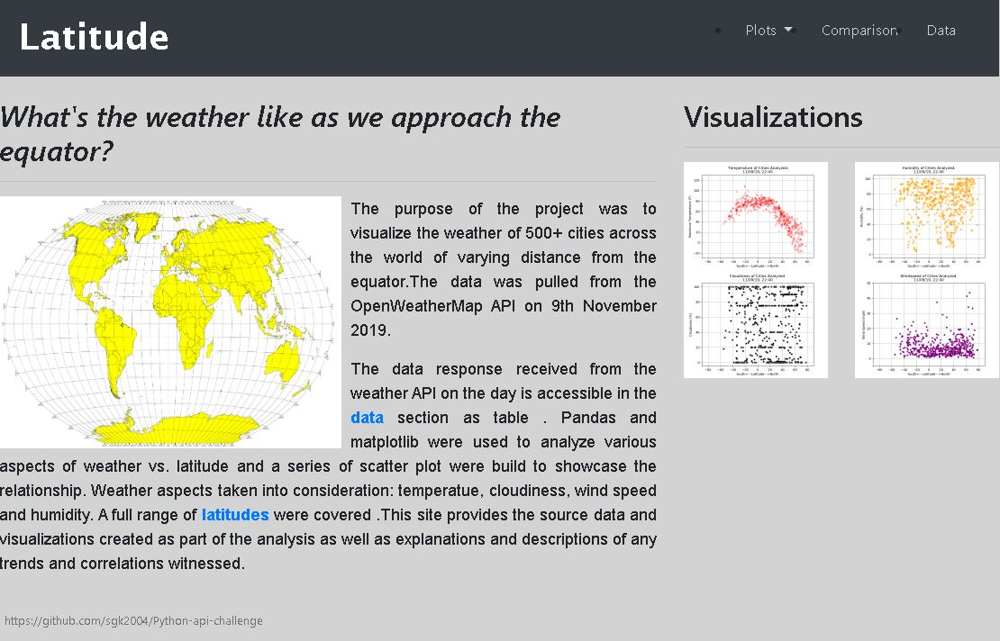

# World's Climate Data

## Web Visualization Dashboard

#### "What's the weather like as we approach the equator?"

Python script to visualize the weather of 500+ cities across the world of varying distance from the equator. 

# Objective is to build a series of scatter plots to showcase the following relationships and build a website

Temperature (F) vs. Latitude

Humidity (%) vs. Latitude

Cloudiness (%) vs. Latitude

Wind Speed (mph) vs. Latitude

Analyzed climate data and created a georeferenced dashboard and deployed the website using GitHub

######  Website [Weather Analysis Vizualisation](https://sgk2004.github.io/Web-Design-Challenge/)

